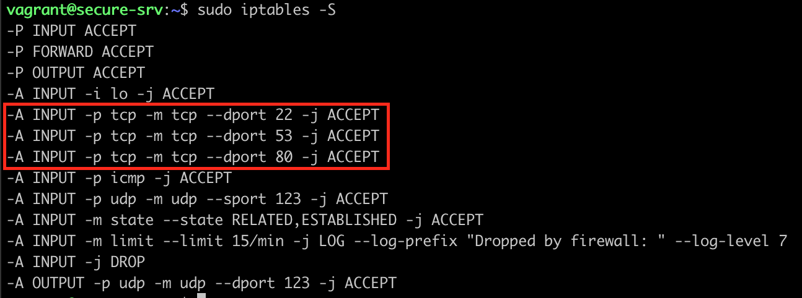

# Demo - Deploy a server Unix-like with access security

This project builds a simple architecture composed of two machines. One respecting (secure-srv) the best practice to secure the access to a server over the internet and another (caller) is here for testing purpose. 

The infrastructure is fairly simple, with the following structure:

                _____________________________________
               |                                     |
     ---------------------------         -----------------------
    | secure-srv (192.168.10.2) |       | caller (192.168.10.3) |
    |       [Ubuntu 18.04]      |       |     [Ubuntu 18.04]    |
     ---------------------------         -----------------------

In order to limit the attack vector of your server from the outside, the best practice is to:
 1. Setup an internal firewall to allow only the ports that your server intends to use
 2. Disable remote root login
 3. Disable password-based SSH authentication
 4. Monitor logins and block suspect IP addresses (this demo uses fail2ban software)

Fail2ban provide an alerting feature (if the server has a SMTP service installed) to notify you by mail when he bans an IP.
Knowing that I'm using Gmail as one of my personal mailbox. I've setup this example to link fail2ban with Gmail's SMTP server.

Thanks to Ansible, we can easilly setup those securities!

## Building the VMs

1. Download and install [VirtualBox](https://www.virtualbox.org/wiki/Downloads).
2. Download and install [Vagrant](http://www.vagrantup.com/downloads.html).
3. [Mac/Linux only] Install [Ansible](http://docs.ansible.com/intro_installation.html).
4. Create an application password to grant access to your gmail mailbox[<sp>1</sp>](#note) (Optional).
  * Go to your [security Google Account](https://myaccount.google.com/security?hl=en).
  * In *Signing in to Google* click to **App passwords** button. You will have to login.
  * Select `Mail` as app & `Other (Custom name)` as device you can name it *vagrant tutorial server* for example.
  * Click on generate button and you should get a password of 16 characters. Save it because it's the only time that Google will display it.
5. Set your gmail credentials in `playbooks/vars/gmail_account.yml` (Optional).
  * Replace <LOCAL_PART> with your gmail account.
  * Replace <PASSWORD> with your app application password.
6. Run `ansible-galaxy install -r requirements.yml` in this directory to get the required Ansible roles.
7. Run `vagrant up` to build the VMs and configure the infrastructure.

At the end to the command, if you have set your gmail credentials, you should have received a mail from fail2ban `subject : [Fail2Ban] sshd: started on secure-srv` saying that the service is up.
If if it's not the case, check the logs from *secure-srv* to find the root cause.

Run the following commands:
```sh
    $ vagrant ssh secure-srv
    $ sudo tail -f /var/log/mail.*
```

### Packages installed only on secure-srv VM

* **Monitoring**
  * fail2ban
* **Librairies needed to send mails**
  * postfix  
  * mailutils
  * libsasl2-modules

### Note

To generate a Google's application password, you must activate 2-factor authentication feature to your account. If you don't want to activate this feature and grant access to mailbox anyway. You can set your account password instead of the app password in step 5.2.
Again, the best practice is to use an app password in order to ease access management. Typically, you can revoke access to a specific app without impacting the rest of the ecosystem.

## Checking VMs setup

  1. Run `vagrant ssh secure-srv` to connect to a specific VM.
  2. Run `sudo iptables -S` to display the list of rules. You should see that the firewall accepts tcp connections to ports 22, 53 & 80

  3. Run `cat /etc/ssh/sshd_config | grep -n "^PasswordAuthentication\|^PermitRootLogin"`. You will observe the variables set to **no**

You will find the same setup on both VMs.

## Performing a simple intrusion test

The *secure-srv* VM has **fail2ban** up & running, monitoring ssh connections.
If a server failed to connect 3 times in window of 30min to the latter it will be ban during 1 hour.

Let's test the policy!

Run the following commands:
```sh
    $ vagrant ssh caller
    # perform ssh connection x3 times -> OK
    $ for i in {1..3}; do ssh johndoe@192.168.10.2; done
    # perform ssh connection x3 times -> REJECT
    $ for i in {1..3}; do ssh johndoe@192.168.10.2; done
```

From fourth attemps you should see this response message `ssh: connect to host 192.168.10.2 port 22: Connection refused` from *secure-srv* because *caller* is now banned.

Normally, if you have set your gmail credentials, you should have received a mail from fail2ban notify you that the IP 192.168.10.2 has been banned.

_Remark_: the user johndoe doesn't exist in the remote server.

## Secure the playbook

As you can see, the gmail account is in plain text, which isn't secure if we need to store this playbook in a source control manager. We have to use a vault service in order to doing so! There are a bunch of services at our disposal but let's use *ansible-vault* in this example.

Run `ansible-vault encrypt playbooks/vars/gmail_account.yml`. The command will ask you to set a secret.

After the operation, if you open `playbooks/vars/gmail_account.yml` you will notice that the file is now encoded. Great!

Presently, we need to indicate to *vagrant* that the ansible need a secret to decrypt the encoded data. Nothing's easier, you just need to uncomment line 31 of `Vagrantfile` and save the update.

Both commands below will ask a secret before running Ansible:
```sh
    # Run the provisioning without change the infrastructure
    $ vagrant provision
    # Destroy and recreate the infrastructure and launch the provisionning
    $ vagrant destroy -f && vagrant up
```

If you need to unencode the file, run `ansible-vault decrypt playbooks/vars/gmail_account.yml`.

## My configuration

You will find below the version of each software used in this demo on my local machine (macOs Mojave).

Software| Version
------------ | -------------
Ansible | 2.8.2
VirtualBox | 6.0.8
Vagrant | 2.2.3
