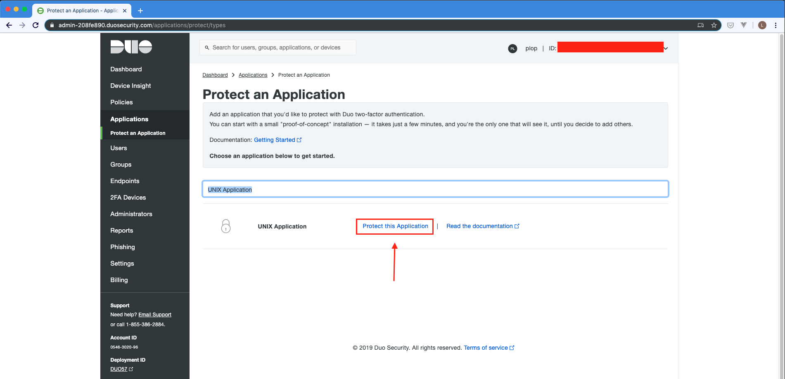
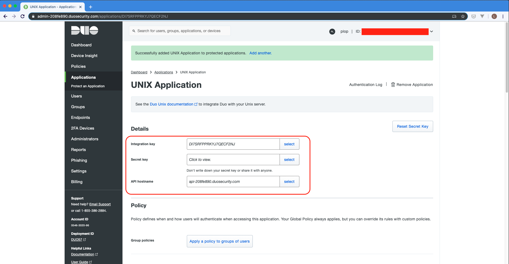
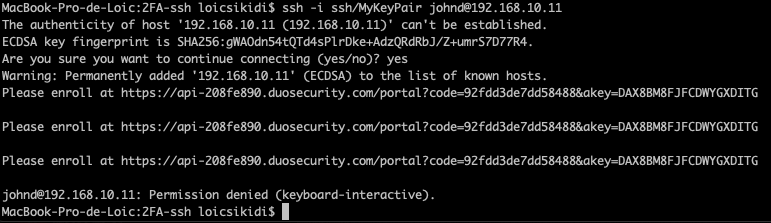

# Demo - Déployer un serveur UNIX avec une connection SSH 2FA

**2FA: two-factor authentification**

Le **cookbook** vagrant construit l'infrastructure suivante:

     ---------------------------        
    |      vm (192.168.10.11)   |       
    |       [Ubuntu 18.04]      |       
     --------------------------- 
 
La mise en place du 2FA sur la connection SSH va être rendu possible par l'intermédiaire d'un service tiers: [DUO](https://duo.com/). Bien évidemment, d'autres acteurs existent sur le marché, c'est un choix arbitraire.


## Pré-requis au bon fonctionnement de vagrant

Si vous n'avez pas de compte duo (ce qui est fort probable), je vous invite à créer un compte gratuit (**Duo Free**) : [ici](https://duo.com/pricing).

Une fois votre compte créé, allez dans **Applications > Protect an Application**.

Ensuite tappez *UNIX Application* dans la barre de recherche et cliquez sur *Protect this application*.





Vous arriverez sur un écran sur lequel se trouve 3 informations de premières importances:

* Integration key
* Secret key
* API hostname




Vous devrez remplacer <DUO_INTEGRATION_KEY>, <DUO_SECRET_KEY> et <DUO_API_HOST> par vos valeurs dans le fichier `provision.yml`.

Sur la même page, vous pouvez changer le nom de l'application UNIX Application (par défaut) par *Vagrant App* par exemple.

## Building the VMs

1. Téléchargez et installez [VirtualBox](https://www.virtualbox.org/wiki/Downloads).
2. Téléchargez et installez [Vagrant](http://www.vagrantup.com/downloads.html).
3. [Mac/Linux only] Installez [Ansible](http://docs.ansible.com/intro_installation.html).
4. Run `vagrant up` à la racine du projet pour  builder l'infrastructure.

## Tester le 2FA

### Avant-Propos

Vous trouverez dans le répertoire `ssh` un jeu de clé SSH (sans passphrase). Le script de provisioning va ajouter la clé publique dans le fichier `authorized_keys` du user **jonhd** afin de pouvoir tester facilement une connection ssh.

En outre, la configuration du pam_duo (accesible dans `templates/pam_duo.conf.j2`) va activer le 2FA pour tous les users hormis ceux qui appartiennent au groupe *exclude_from_2fa*. Seul le user vagrant (celui utilisé par Ansible) est dans ce groupe afin d'affranchir Ansible de ce type d'authenfication.

Le plus important, à garder en tête c'est qu'on peut limiter la connection ssh 2FA à un groupe restreint d'utilisateurs.

### Commandes à réaliser

*Run à la racine du projet*
```sh
ssh -i ssh/MyKeyPair johnd@192.168.10.11
```

Vous devriez avoir un comptortement similaire au sceenshot suivant:



Duo vous invite à *enroller* le user jonhd en accedant à un lien.

*Sachant que le user vagrant est exclu du 2FA, le 2FA sera désactivé*
```sh
ssh -i ~/.vagrant.d/insecure_private_key vagrant@192.168.10.11
```

## Ma configuration

Vous trouverez ci-dessous la version de chaque outil utilisé lors de la démo sur mon laptop (macOs Mojave)

Software| Version
------------ | -------------
Ansible | 2.8.2
VirtualBox | 6.0.8
Vagrant | 2.2.3